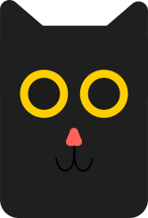
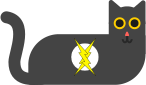

# blackcatbot.com

## Website for the Discord bot Bläck Cät

### The three F's

- **Fun(adj): Enjoyable.**

- **Fast(adj): Moving or happening quickly, or able to move or happen quickly.**

- **Facile(adj): Easy or too easy; not needing effort.**

_Dunno why I did this. This is dumb._

### Some details

I used [Node.js](https://nodejs.org/en/) with [Vue.js 3](https://v3.vuejs.org/) for frontend and [Express.js](https://expressjs.com/) for some light backend work as well as serving the static build.
Used Adobe Illustrator for the images and the new logo.

### Some images i guess

